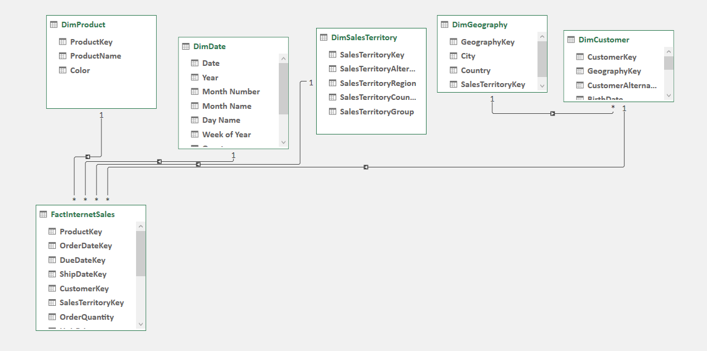
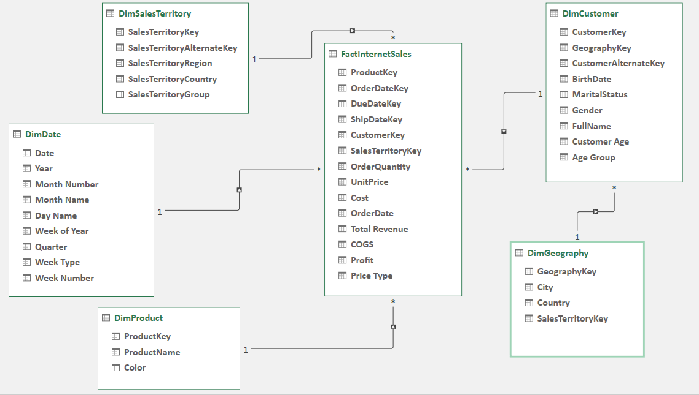
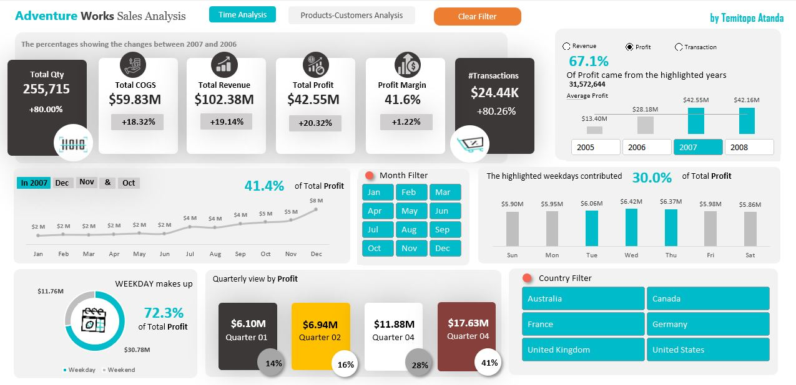
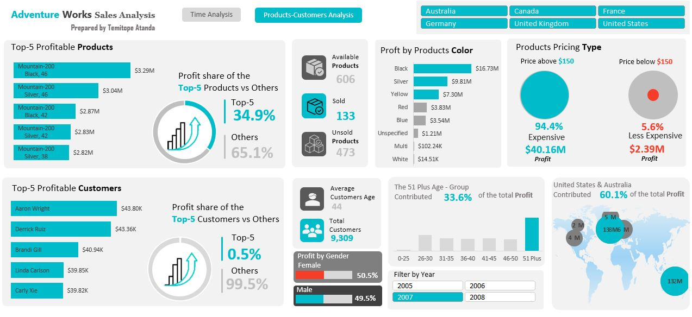

# Adventure Works Sales Analysis

***

### Introduction
---

Embarking on an enlightening exploration guided by a comprehensive roadmap, this project involves a detailed analysis of the Adventure Works sales dataset extracted from Microsoft's SQL Server Adventureworks sample database. The necessary tables were thoughtfully extracted for further examination and analysis.

The dataset comprises six pivotal tables, meticulously curated for analysis: 
- FactInternetSales, 
- DimProduct, 
- DimDate, 
- DimSalesTerritory, 
- DimCustomer, 
- DimGeography.

### Problem Statement ❓:

Equipped with an extensive dataset spanning four years from the AdventureWorks sample database, my main objective is to reveal insightful trends and patterns 📈. This endeavor centers on conducting a comprehensive evaluation of overall performance, placing special emphasis on meticulously analyzing product profitability, customer locations (countries), and temporal trends within these years. 

### Project Objectives 🎯:

**Comprehensive KPI Analysis 📊:**
- Conduct an in-depth comparison of COGS, Revenue, Quantity, Profit, Profit Margin, and Transactions for the current year against the previous year.

**Identify Above Average Years 🌟:**
- Uncover insights into total revenue, profit, and transactions, focusing on years that surpass average performance benchmarks.

**Monthly Profit Trend Analysis 📅:**
- Analyze monthly profit trends, distilling patterns, and fluctuations over the four-year period.

**Dynamics of Profit by Week Type 🗓️:**
Assess profit dynamics based on different week types to understand variations and trends.

**Quarterly Profit Performance Evaluation 📅:**
- Evaluate profit performance on a quarterly basis, identifying trends and variations throughout the year.

**Examine Profit by Weekday 📆:**
- Explore profit trends specific to weekdays, uncovering potential patterns.

**Top 5 Profitable Products Identification 💰:**
- Identify the top five profitable products and understand their percentage contribution to total profits, gaining insights into the remaining products.

**Showcase Top 5 Profitable Customers 🤝:**
- Highlight the top five high-profit customers, spotlighting their percentage share of overall profits, along with detailed contributions from other customers.

**Gender-Based Profit Analysis:**
- Display a breakdown of profits by gender, facilitating the identification of gender-based profit trends within the customer base.

**Profit Analysis by Product Color 🎨:**
- Analyze profits associated with product colors, accentuating the optimization of best-selling colors.

**Examine Profit Variations by Pricing Types 💵:**
- Investigate profit variations based on pricing types, providing insights into the effectiveness of different pricing strategies.

**Country-wise Profit Distribution with Custom Map 🗺️:**
- Utilize a custom map to visually represent profit distribution by country, enabling targeted geographic strategies based on sales performance.

**Age Group Segmentation for Profit Analysis 👶👦👨👴:**
- Segment profits into age groups to comprehend the demographic contributions to profitability, identifying which age groups contribute the most.

**Tool Used:** Microsoft Excel  

---

### Analysis Process 

To accomplish my goals, I thoroughly examined the six tables at my disposal and conducted an Exploratory Data Analysis (EDA). To enhance the data integration process, I opted for an advanced approach in Excel. Instead of relying solely on Vlook up or Index-Match functions to merge the tables together based on the relationship keys, I chose to leverage the power of Excel Power Query Editor by loading the data into a modeling environment.

During the data cleaning phase, I identified and removed unnecessary columns from the six tables, focusing on retaining the most relevant data for my analysis. To further refine the data and meet the project objectives, I employed DAX functions within the Excel Power Query Editor and most of the Dax was done through power pivot on Excel environment. 

One significant aspect of the data transformation involved the creation of a **Conditional column** to categorize _**Week Types**_ as either Weekday or Weekend. Using the Day Name parameter, I defined the logic as follows: 

_**If the Day Name is Saturday or Sunday, then categorize it as Weekend; otherwise, label it as Weekday**._

Additionally, I implemented metrics for classifying products into Expensive and Less Expensive categories. The criteria were set as follows: If the product price is less than or equal to **$150**, categorize it as **Less Expensive**; otherwise, label it as **Expensive**. This classification enabled me to compare the percentage rates of Less Expensive products to Expensive products based on their prices.

### Skills / Concept demonstrated:
- Page navigation
- Filters
- Buttons
- Modelling
- Dax
- Excel functions
- Record Macro
- Pivot tables 

 ### Modeling: 

 Automatically generated relationships are adjusted to remove and replace unwanted relationship with required. 

  Auto - Model                                                              |                                      Adjusted - Model 
 :-------------------------------------------------------------------------:| :---------------------------------------------------------------------------------------:                                                    
                                                     |      

 
 
 
 The model is a Snowflake Schema. 
 There is one fact table and 5- dimension tables. Among these, four are directly linked to the fact table, while the remaining one is connected to another dimension table.

### The dax and functions overview
I created some Dax to achieve my KPIs using functions like 

- Distinct count function
- Sum function
- Divide function.
- Average function
- CountRows function
 
 _**And some other Excel functions for the insights such as**_
 
- Large function 
- Max function
- Index- Match function
- IF and IFs function

 **How the functions are written using Dax on Excel**

- Total Customers = DISTINCTCOUNT (FactlnternetSales [CustomerKey]) 

- Total Revenue = [Price] * [ OrderQuantity] 

- COGS = [OrderQuantity]*[Cost] 

- Total Profit = [Revenue] – [COGS] 

- #Transaction = COUNTROWS(FactIntemetSales) 

- Quantity = Sum (FactIntemetSales [OrderQuantity]) 

- % Profit Margin = DIVIDE (Sum of Profit]. [Sum of Total Revenue],0) 

- All Product:  COUNTROWS(DimProduct) 
- Sold Product = DISTINCTCOUNT (FactInternetSales [ProductKey]) 

- Unsold = [All Product] - [Sold Product] 

- Avg Customers Age = AVERAGE (DimCustomer [Customer Age]) 

### KPIs Results
- Total Customers = 18,484
- Total Revenue = $307,0929,45.20
- COGS = 1$80,802,367.55
- Total Profit = $126,290,577.65
- #Transaction = 60,398
- Quantity = 631,920
- % Profit Margin = 41.1%
- All Product = 606
- Sold Product = 158
- Unsold = 448
- Avg Customers Age = 44 years

## Data Visualization and Analayis 
---
 
 The report comprises of 2 tables namely; 
  1. Time Series Analysis
  2. Products - Customers Analysis

### Time Analysis:

  To achieve the questions, I set for myself on this project I have to carryout a comprehensive analysis to determine the year that generated profit above average. 
  Year 2007 and 2008 generated profit at (67.1%). 

- Monthly Profit Trend Analysis, It was discovered that Month of May at (13,733,395), June at (13,445,658.30) and December at (13,143,417.37) which these years contributed 39.9% of 
  the total profit.

- Dynamics of Profit by Week Type: Most of the profit was generated during the weekday at total sum of 90,937,627.35 at 72.1% and during the weekday, Wednesdays, Thursday, and Friday 
  contributed 43.8% of the total profit. 

- Evaluation of profit performance on a quarterly basis, identifying trends and variations throughout the year: Quarter: Quarter 2 contributed the most profit with total of 39,018,891.40 at (31% ) follow by Quarter 1 with 32,300,639.02 at (26%)

## Products and Customers Analysis:
  
   ### Products Analysis 
   

- With total products of **606**, I only wanted to compare what is the contribution of top 5 products by profit against other products. 

- Comparison of profit share of the Top 5 Products against Others: Top 5 products generated 24.8% at (31,270,387.55) of total profit while the remaining he products (Others) generated 
 75.2% at (95,020,190.10) 

- Profit Analysis by Product Color: Here I want to know which color of the products are best-selling and based on my finding the best-selling color is Black with 39,160,817, follow by  
 Red at 31,594,382 and Silver with sum of 23,916,414

- Examine Profit Variations by Pricing Types: To arrive at Expensive and Less Expensive, the metrics i set for this was any product that its price is less than or equal to 150 dollar 
  it should be less expensive and else expensive here I can see that most customers went more for Expensive products which contributed 120,521,313 of total profit at 95.4% 

### Customers Analysis 

Our total customers were **18,48** and Average age of our customers was **44 years**. 

#### Top 5 Profitable Customers against Others:  
- Willie Xu is the most profitable customer with total profit of $80,609 and Top 5 Customers profit distribution was 61,985 at 0.3% while other customers profit distribution was $125,939,566 at 99.7%

#### Customers Demographic 

Gender-Based Profit Analysis : There is a close relationship between both gender: The Male gender contributed 50.4 of total profit while Female at 49.6%
- Age 51 plus contributed 33.8% of the total profit.

#### Customers Location Analysis
- Australia and United States contributed 62.7% of the total profit with United States generated total sum of $40,537,131 and Australia with total sum of $38,700,142.

In pursuit of my project objectives, I conducted a thorough analysis to identify standout years in profit generation. Notably, 2007 and 2008 marked exceptional performance, yielding a combined profit share of 67.1%. Delving into monthly trends, May, June, and December emerged as pivotal contributors, accounting for 39.9% of the total profit. The dynamics of profit by week highlighted weekdays as prime profit generators, accumulating 72.1%, with Wednesday, Thursday, and Friday alone contributing 43.8%. Quarterly evaluation showcased Quarter 2 as the most lucrative, yielding 31%, followed by Quarter 1 at 26%.

In product analysis, among 606 products, the top 5 products commanded a 24.8% profit share, amounting to $31,270,387.55, while the remaining products (Others) contributed 75.2% at $95,020,190.10. Exploring product colors, Black emerged as the best-seller, raking in $39,160,817, followed by Red at $31,594,382, and Silver at $23,916,414.

Examining profit variations by pricing types revealed that products above $150, categorized as "Expensive," dominated, contributing 95.4% of the total profit, totaling $120,521,313.

In customer analysis, with a total of 1,848 customers and an average age of 44 years, the top 5 profitable customers, led by Willie Xu, amassed $80,609 in total profit. However, this group constituted a mere 0.3%, with other customers contributing $125,939,566, representing 99.7% of the total profit.

Analyzing customer demographics, gender-based profit showed a balanced contribution, with males at 50.4% and females at 49.6%. Customers aged 51 and above made a significant impact, contributing 33.8% to the total profit. Geographically, Australia and the United States jointly accounted for 62.7% of the total profit, with the United States generating $40,537,131 and Australia contributing $38,700,142.

---

## Recommendations and Conclusions 

- The company should focus on the patterns observed in profitable years (2007 and 2008) to identify any specific strategies or market conditions that led to above-average profits.

- Allocate resources and marketing efforts strategically, emphasizing Quarter 2 based on historical data. This approach will maximize returns during peak periods, optimizing our 
  overall quarterly performance.

- Implement targeted marketing initiatives, promotions, and product launches during high-profit months (May, June, and December). Leveraging these peak periods can enhance market visibility and drive increased sales.

- Focus on the top 5 profitable products while exploring strategies to boost sales for other products. A balanced optimization approach ensures a diverse and competitive product portfolio that appeals to a wider customer base.

- Prioritize customer retention efforts, particularly with high-profit customers like Willie Xu and the top 5 customers. Introduce loyalty programs and personalized offers to strengthen customer relationships and foster long-term loyalty.

## Conclusion 
As we navigate the path ahead, these insights provide a solid foundation for strategic decision-making. By applying these personalized recommendations, I am confident that we can enhance our business performance and drive sustained success. 👍

#### Thank you for your time 

You can connect with me on LinkedIn [Here] (https://www.linkedin.com/in/temitopeatandao/)

